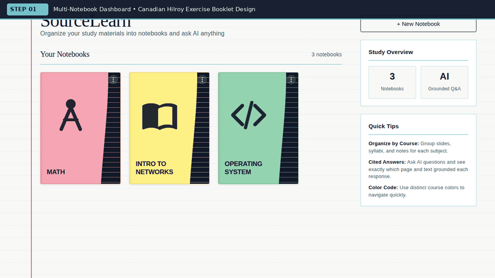
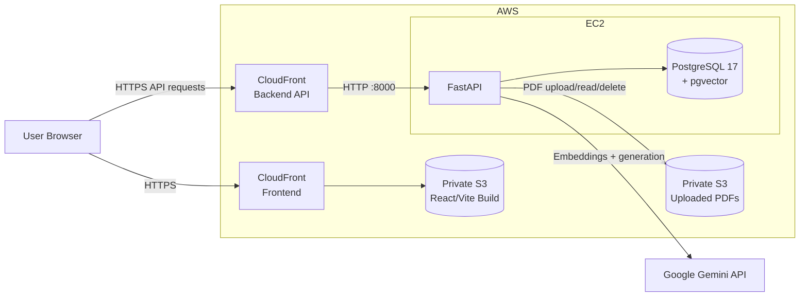
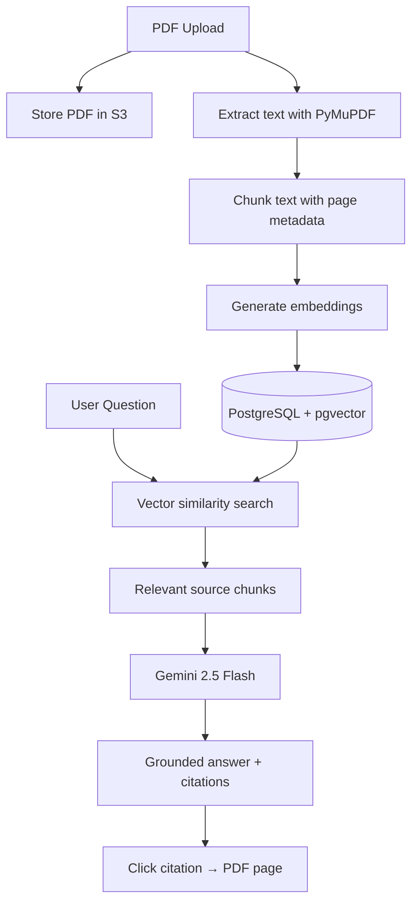
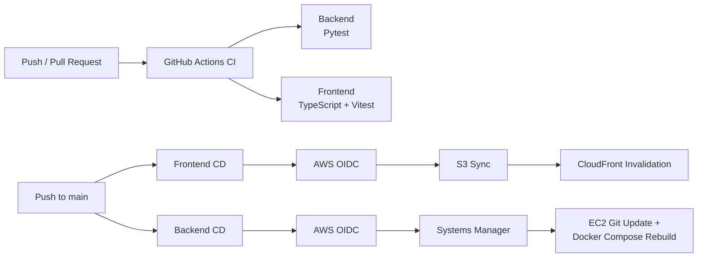

<div align="center">

# SourceLearn

**A citation-grounded AI study assistant for turning course PDFs into searchable, source-linked conversations.**

Upload study materials, organize them into notebooks, ask questions across your documents, and jump directly from an AI citation to the supporting PDF page.

[**Live Demo**](https://d3kmtqljhqewdz.cloudfront.net) · [Architecture](docs/architecture.md) · [RAG Pipeline](docs/rag-pipeline.md) · [CI/CD Guide](docs/ci-cd-guide.md) · [AWS Guide](docs/aws-integration-guide.md)

[](https://github.com/reganvannguyen/SourceLearn/actions/workflows/ci.yml)
[](https://github.com/reganvannguyen/SourceLearn/actions/workflows/deploy-frontend.yml)
[](https://github.com/reganvannguyen/SourceLearn/actions/workflows/deploy-backend.yml)

<br/>



</div>

---

## What SourceLearn Does

SourceLearn is a full-stack Retrieval-Augmented Generation (RAG) application built around a simple workflow:

```text
Upload PDFs
    ↓
Extract + chunk text
    ↓
Generate embeddings
    ↓
Store vectors in PostgreSQL + pgvector
    ↓
Ask a question
    ↓
Retrieve relevant source chunks
    ↓
Generate a grounded answer with citations
    ↓
Open the cited PDF page
```

The application is designed so that users can verify answers against the original material instead of treating the model response as an unsupported summary.

## Key Features

| Feature | Description |
| --- | --- |
| **Notebook organization** | Create notebooks for courses or topics and organize uploaded study material in one place. |
| **PDF ingestion** | Extracts PDF text with PyMuPDF, chunks it by page, generates embeddings, and stores them in pgvector. |
| **Citation-grounded Q&A** | Retrieves relevant chunks before generating an answer and returns citations tied to the source document and page. |
| **Interactive PDF viewer** | Open a citation directly in the corresponding PDF and inspect the supporting material. |
| **Multi-turn chat** | Maintains notebook-specific conversation history and supports follow-up questions. |
| **Private S3 document storage** | Uploaded PDFs are stored in a private S3 bucket rather than on the EC2 filesystem. |
| **Automated CI/CD** | GitHub Actions tests the application and deploys frontend/backend changes to AWS. |

---

## Architecture

### Application + AWS Deployment



### RAG Request Flow



---

## CI/CD

SourceLearn uses GitHub Actions for both continuous integration and continuous deployment.



### Frontend deployment

```text
main
→ TypeScript + Vitest
→ Vite production build
→ GitHub OIDC
→ S3 sync
→ CloudFront invalidation
```

### Backend deployment

```text
main
→ Pytest
→ GitHub OIDC
→ AWS Systems Manager Run Command
→ EC2 updates repository
→ Docker Compose rebuild
→ deployment verification
```

GitHub does not store long-lived AWS access keys or the EC2 SSH private key. Deployment access is provided through an IAM role assumed with GitHub OIDC.

See [docs/ci-cd-guide.md](docs/ci-cd-guide.md) for the full deployment walkthrough.

---

## Tech Stack

| Layer | Technologies |
| --- | --- |
| **Frontend** | React, TypeScript, Vite, React Router |
| **Backend** | Python, FastAPI, SQLAlchemy, Pydantic |
| **Database** | PostgreSQL 17, pgvector |
| **AI / RAG** | Gemini 2.5 Flash, Gemini embeddings, PyMuPDF |
| **Storage** | Amazon S3 |
| **Hosting** | Amazon EC2, CloudFront |
| **Infrastructure / DevOps** | Docker, Docker Compose, GitHub Actions, AWS IAM, OIDC, Systems Manager |

---

## AWS Design

SourceLearn separates application responsibilities across AWS services:

```text
S3 document bucket
  → private uploaded PDFs

S3 frontend bucket
  → compiled React/Vite assets

CloudFront frontend distribution
  → HTTPS delivery of the web application

CloudFront backend distribution
  → HTTPS API endpoint

EC2
  → FastAPI
  → PostgreSQL + pgvector
  → Docker Compose

EC2 IAM role
  → document S3 access
  → Systems Manager managed-instance access

GitHub Actions IAM role
  → assumed through OIDC
  → frontend S3/CloudFront deployment
  → backend SSM deployment
```

The application uses boto3's normal AWS credential chain, allowing local development to use local credentials while EC2 uses an IAM role without changing backend code.

---

## Local Development

### Prerequisites

- Docker + Docker Compose
- Python 3.12
- Node.js 22
- Google Gemini API key
- AWS credentials with access to the configured development S3 bucket

### Backend environment

Create a local backend `.env` from the example file and configure values such as:

```env
GEMINI_API_KEY=your_key
AWS_REGION=ca-central-1
S3_BUCKET_NAME=your_document_bucket
```

Local AWS credentials should remain outside source control.

### Start the application

```bash
git clone https://github.com/reganvannguyen/SourceLearn.git
cd SourceLearn
chmod +x start.sh
./start.sh
```

The development frontend runs at:

```text
http://localhost:5173
```

FastAPI runs at:

```text
http://localhost:8000
```

---

## Repository Structure

```text
SourceLearn/
├── .github/
│   └── workflows/
│       ├── ci.yml
│       ├── deploy-frontend.yml
│       └── deploy-backend.yml
├── backend/
│   ├── app/
│   │   ├── api/
│   │   ├── db/
│   │   ├── models/
│   │   ├── schemas/
│   │   └── services/
│   ├── docker-compose.yml
│   └── docker-compose.prod.yml
├── frontend/
│   └── src/
├── docs/
│   ├── architecture.md
│   ├── rag-pipeline.md
│   ├── api-reference.md
│   ├── setup-guide.md
│   ├── aws-integration-guide.md
│   └── ci-cd-guide.md
└── README.md
```

---

## Documentation

- [System Architecture](docs/architecture.md)
- [RAG Pipeline](docs/rag-pipeline.md)
- [REST API Reference](docs/api-reference.md)
- [Local Setup & Troubleshooting](docs/setup-guide.md)
- [AWS Integration Guide](docs/aws-integration-guide.md)
- [CI/CD Guide](docs/ci-cd-guide.md)

---

## Live Deployment

**Frontend:** https://d3kmtqljhqewdz.cloudfront.net

The production deployment is intended as a portfolio/demo environment. Uploaded documents are stored in the configured private S3 bucket.

---

## License

Distributed under the MIT License. See [LICENSE](LICENSE).
