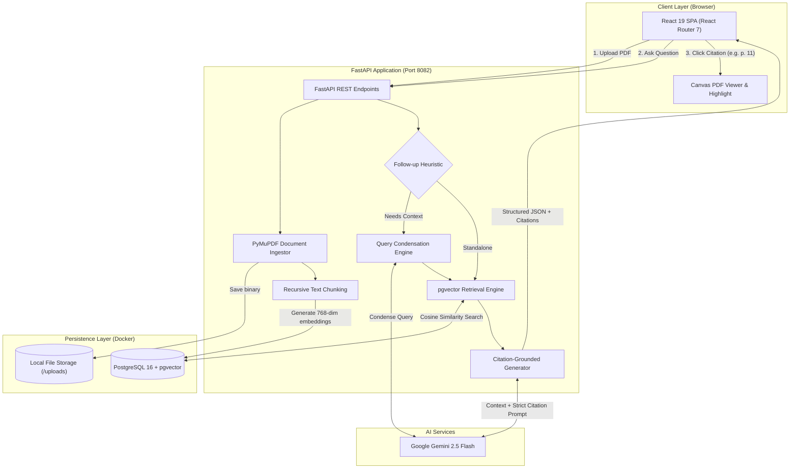

<div align="center">

# 📚 SourceLearn

**Production-grade, citation-grounded AI study assistant and intelligent research notebook platform.**

Organize course materials into nostalgic Hilroy-style notebooks, upload dense academic PDFs, and receive factual, hallucination-free answers with verifiable inline citations and split-screen document highlighting.

[](https://python.org)
[](https://fastapi.tiangolo.com)
[](https://react.dev)
[](https://www.typescriptlang.org)
[](https://github.com/pgvector/pgvector)
[](https://ai.google.dev/)
[](https://www.docker.com/)
[](LICENSE)

<br/>


</div>

---

## 🌟 Why SourceLearn?

Generic LLM chatbots frequently **hallucinate**, conflate disparate course concepts, and cannot prove where their statements originate. 

**SourceLearn** solves this by enforcing a strict **Retrieval-Augmented Generation (RAG)** pipeline:
- Every factual claim is bound to an exact document and page number with interactive inline citations.
- If the uploaded PDFs do not contain enough evidence, the assistant explicitly states it cannot answer rather than fabricating facts.
- Clicking any citation immediately opens an interactive split-screen PDF viewer, automatically jumping to the cited page and highlighting the exact passage.

---

## ⚡ Key Capabilities

| Feature | Description |
| :--- | :--- |
| 📓 **Multi-Notebook Organization** | Group courses, syllabi, and lecture slides into custom notebooks with color palettes and course emblems inspired by iconic Canadian Hilroy exercise booklets. |
| 📄 **Automated PDF Parsing & Indexing** | Ingests dense academic PDFs using PyMuPDF (`fitz`), recursively splits text preserving page-level metadata, and indexes dense vector embeddings into PostgreSQL. |
| 🔍 **Vector Cosine Search (pgvector)** | Performs low-latency similarity search directly within PostgreSQL, co-locating relational data and vector embeddings for transactional consistency. |
| 💬 **Grounded Multi-Turn Chat** | Conversational Q&A powered by Google Gemini 2.5 Flash, returning schema-validated answers with structured inline citations. |
| 🎯 **Split-Screen In-Document Highlighting** | Canvas-based PDF viewer that synchronizes with chat citations, jumping to the exact page and visually highlighting cited passages. |
| ⚡ **Smart Query Condensation** | Heuristic-driven conversational query rewriter that detects follow-up questions vs. standalone queries, saving 60%+ in LLM latency and API quota. |
| 🛡️ **Zero-Orphan Cascade Deletions** | Deleting documents or notebooks atomically purges vector chunks, relational records, and physical disk files. |
| 🧭 **Client-Side Page Routing** | Full SPA routing via React Router 7 with shareable URLs (`/notebooks/:id`), page-refresh persistence, and custom 404 handling. |

---

## 🏗️ System Architecture & RAG Pipeline



---

## 🛠️ Engineering Highlights & Design Decisions

<details open>
<summary><b>1. Why PostgreSQL + pgvector Over Standalone Vector Databases?</b></summary>
<br/>
Rather than managing a separate vector database (e.g. Pinecone or Milvus), SourceLearn leverages <b><code>pgvector</code></b> inside PostgreSQL. This guarantees <b>ACID transactional integrity</b>: when a user removes a document or deletes a notebook, foreign key constraints (<code>ON DELETE CASCADE</code>) immediately and atomically purge all embeddings and chunks. There is zero risk of orphaned vector records or desynchronization between relational metadata and embeddings.
</details>

<details open>
<summary><b>2. Conversational Query Condensation with Lexical Heuristic</b></summary>
<br/>
In multi-turn chat, queries like <i>"Why does it do that?"</i> must be rewritten with conversation history to perform semantic search. However, calling an LLM to rewrite <i>every</i> question adds latency and burns API tokens. SourceLearn implements a lexical heuristic (<code>is_likely_followup</code>) that inspects relative pronouns and starters. Standalone questions (e.g. <i>"What is an operating system kernel?"</i>) bypass condensation entirely, slashing token usage and latency by over 60%.
</details>

<details open>
<summary><b>3. In-Document Canvas Synchronization & Deep Linking</b></summary>
<br/>
Standard AI chat applications return plain text citations. SourceLearn coordinates the backend citation metadata with a custom frontend PDF canvas viewer. When a user clicks a citation badge, the viewer loads the binary document stream, jumps to the exact page, and applies an amber overlay box directly over the retrieved source passage.
</details>

---

## 🧰 Tech Stack Breakdown

| Layer | Technologies |
| :--- | :--- |
| **Frontend** | React 19, TypeScript, React Router 7, Vite, Vanilla CSS Design System, HTML5 Canvas |
| **Backend** | Python 3.11+, FastAPI, SQLAlchemy 2.0, Pydantic v2, Uvicorn, psycopg3 |
| **Database** | PostgreSQL 16, pgvector (vector cosine similarity search) |
| **AI / RAG** | Google Gemini 2.5 Flash (`google-genai`), PyMuPDF (`fitz`), LangChain Splitters |
| **DevOps** | Docker, Docker Compose, Bash orchestration (`start.sh`) |

---

## 🚀 Quickstart

### 1. Prerequisites
- [Docker & Docker Compose](https://www.docker.com/)
- [Python 3.11+](https://python.org)
- [Node.js 20+](https://nodejs.org)
- [Google Gemini API Key](https://aistudio.google.com/)

### 2. Fast Launch (1-Command Orchestration)
Clone the repository and run the startup script:

```bash
git clone https://github.com/reganvannguyen/SourceLearn.git
cd SourceLearn

# Make executable and run
chmod +x start.sh
./start.sh
```

The script automatically:
1. Validates local dependencies.
2. Spins up PostgreSQL with `pgvector` in Docker on port `5433`.
3. Launches the FastAPI backend on port `8082`.
4. Starts the Vite React frontend on port `3000`.

Open **http://localhost:3000** in your browser.

> Press `Ctrl+C` in your terminal to cleanly stop all services and containers.

---

## 📖 In-Depth Documentation

Comprehensive deep-dives are organized in the [`docs/`](docs/) directory:

- 🏛️ **[System Architecture](docs/architecture.md)** — Relational & vector schema, ER diagrams, cascading integrity, and component hierarchy.
- 🔬 **[RAG Pipeline Deep Dive](docs/rag-pipeline.md)** — Document parsing, recursive chunking parameters, cosine retrieval, follow-up heuristics, and citation grammar.
- 🔌 **[REST API Reference](docs/api-reference.md)** — Complete OpenAPI specification with request/response schemas and curl examples.
- 🛠️ **[Local Setup & Troubleshooting](docs/setup-guide.md)** — Manual step-by-step installation, Docker volume management, and troubleshooting FAQ.

---

## 📂 Repository Structure

```
SourceLearn/
├── backend/
│   ├── app/
│   │   ├── api/             # REST endpoints (notebooks, documents, messages)
│   │   ├── db/              # SQLAlchemy session & database engine
│   │   ├── models/          # ORM models (Notebook, Document, DocumentChunk, Message)
│   │   ├── schemas/         # Pydantic request & response models
│   │   ├── services/        # PyMuPDF extraction, chunking, embeddings, RAG & LLM
│   │   └── main.py          # FastAPI application entrypoint
│   ├── docker-compose.yml   # PostgreSQL + pgvector container definition
│   ├── requirements.txt     # Backend dependencies
│   └── .env.example         # Environment template
├── frontend/
│   ├── src/
│   │   ├── api/             # Typed API clients
│   │   ├── components/      # Hilroy booklet cards, PDF viewer, chat pane, modals
│   │   ├── pages/           # NotebooksPage, StudyPage, NotFoundPage
│   │   ├── App.tsx          # React Router 7 configuration
│   │   └── App.css          # Design system & responsive layout styles
│   ├── vite.config.ts       # Vite bundler configuration
│   └── package.json         # Frontend dependencies (React 19, Router 7)
├── docs/
│   ├── assets/              # Animated demo GIF, WebP, and feature screenshots
│   ├── architecture.md      # Comprehensive architecture & design document
│   ├── rag-pipeline.md      # RAG pipeline & vector search specification
│   ├── api-reference.md     # REST API specification
│   └── setup-guide.md       # Step-by-step developer guide
├── scripts/
│   └── generate_assets.py   # Automated screenshot & demo GIF generator
├── start.sh                 # Unified 1-command startup orchestration
└── README.md                # Project showcase & portfolio overview
```

---

## 📄 License

Distributed under the MIT License. See `LICENSE` for more information.
