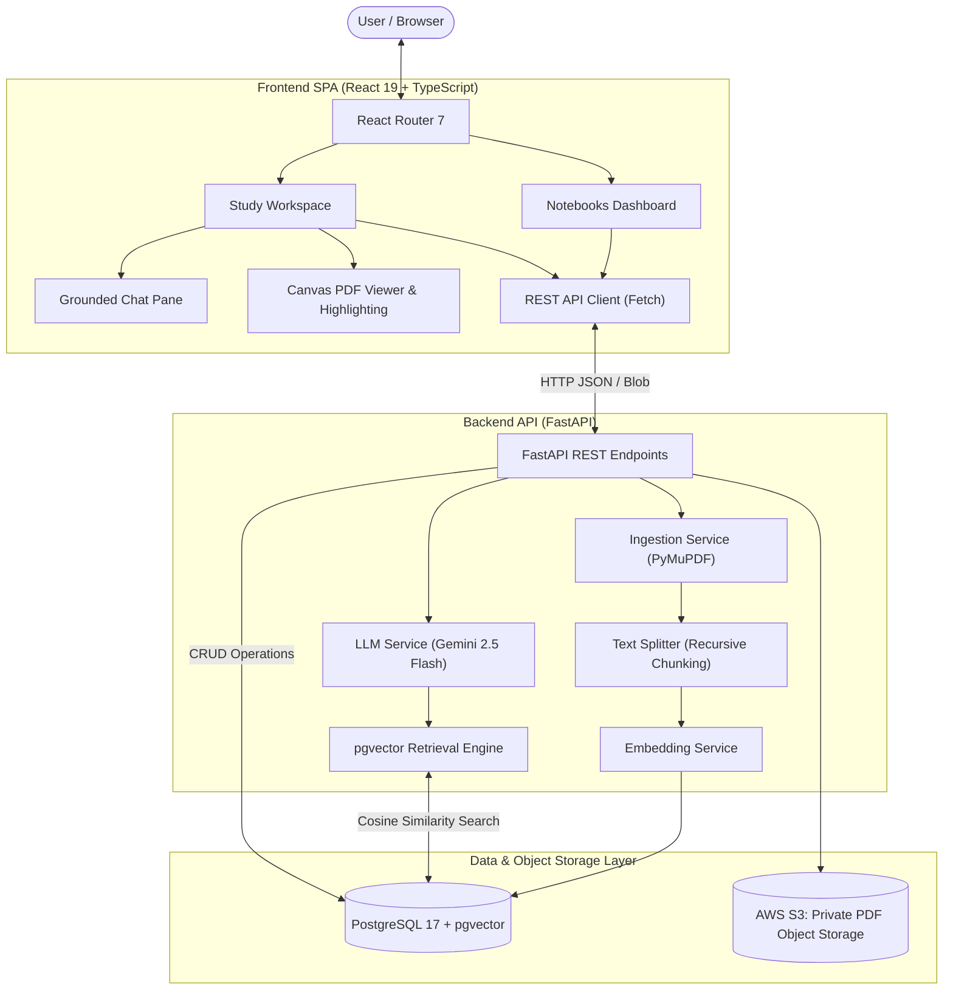
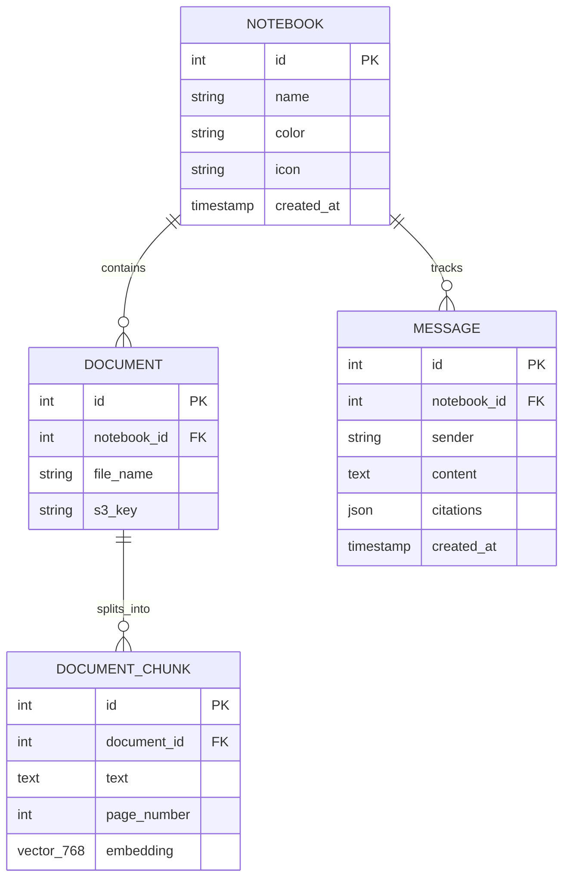

# System Architecture & Design

This document details the high-level architecture, relational and vector database schema, component relationships, and engineering trade-offs of **SourceLearn**.

---

## 1. High-Level System Architecture

SourceLearn is built as a decoupled, full-stack application composed of:
- **Frontend SPA**: React 19, TypeScript, and React Router 7 styled with a custom vanilla CSS design system (inspired by Canadian Hilroy exercise booklets) and a canvas-based PDF reader.
- **Backend API**: FastAPI asynchronous REST service executing ingestion, chunking, vector retrieval, and LLM synthesis.
- **Database & Vector Store**: PostgreSQL with the `pgvector` extension, uniting relational metadata and dense vector embeddings within a single ACID-compliant database.
- **AI / LLM Layer**: Google Gemini 2.5 Flash for conversational query rewriting and strict citation-grounded response generation.

---

## 2. Database Schema & Entity Relationships

The data model connects courses/notebooks, uploaded PDF documents, vector-indexed chunks, and conversational chat history.

### Schema Specifications

#### `notebooks` Table
Represents an isolated study workspace (e.g., "Operating Systems", "Discrete Mathematics").
- `id` (Integer, Primary Key, autoincrement)
- `name` (String, non-empty, required)
- `color` (String, hex color code for booklet accent)
- `icon` (String, SVG icon key: `book`, `code`, `math`, etc.)
- `created_at` (DateTime, UTC timestamp)

#### `documents` Table
Represents an uploaded source PDF file associated with a notebook.
- `id` (Integer, Primary Key, autoincrement)
- `notebook_id` (Integer, Foreign Key &rarr; `notebooks.id`)
- `file_name` (String, original client filename)
- `s3_key` (String, AWS S3 object key `notebooks/{id}/documents/{file}`)

#### `document_chunks` Table
Stores parsed text segments along with dense vector embeddings for nearest-neighbor similarity search.
- `id` (Integer, Primary Key, autoincrement)
- `document_id` (Integer, Foreign Key &rarr; `documents.id`)
- `text` (Text, normalized chunk content)
- `page_number` (Integer, 1-indexed source PDF page)
- `embedding` (`Vector(768)`, dense vector representation generated by embedding model)

#### `messages` Table
Tracks multi-turn conversation history per notebook.
- `id` (Integer, Primary Key, autoincrement)
- `notebook_id` (Integer, Foreign Key &rarr; `notebooks.id`)
- `sender` (String, `'user'` | `'assistant'`)
- `content` (Text, chat message text)
- `citations` (JSON, array of `{ document_id, file_name, page_number, snippet }` items)
- `created_at` (DateTime, UTC timestamp)

---

## 3. Engineering Decisions & Architecture Trade-offs

### Why PostgreSQL + `pgvector` Instead of External Vector DBs?
Many applications use standalone vector databases (e.g., Pinecone, Milvus, Qdrant). For SourceLearn, **`pgvector`** co-located inside PostgreSQL was chosen deliberately:

1. **Transactional Consistency (ACID)**: When a user deletes a notebook or document, backend endpoints transactionally remove all associated embeddings, text chunks, and chat messages within the same database transaction alongside S3 object deletion. There is zero risk of orphaned vector embeddings or desynchronized state.
2. **Simplified Operational Overhead**: A single Docker container handles both relational metadata and dense vector similarity search, eliminating multi-service network latency and operational complexity.
3. **Hybrid Querying**: Enables filtering vectors directly by `document_id` or `notebook_id` in SQL queries before or during cosine similarity ranking.

### Conversational Query Condensation Heuristic
Multi-turn conversational RAG typically re-writes every user question via an LLM before performing retrieval. SourceLearn introduces a smart heuristic layer:
- **Standalone Heuristic Detection**: If a user's question has sufficient token length and contains no pronouns (`it`, `they`, `that`) or follow-up markers (`why?`, `how so?`), it bypasses the condensation LLM call entirely.
- **Latency & Quota Optimization**: Saves 60–70% of unnecessary LLM calls, protecting Gemini API quotas and reducing time-to-first-token.

### Split-Screen In-Document Citation UX
Unlike conventional AI chat apps that merely display a page number, SourceLearn links each inline citation badge directly to the client PDF viewer:
1. Clicking a citation (`[p. 6]`) opens the split-screen PDF pane.
2. The viewer automatically navigates to page `6`.
3. The citation's text snippet is highlighted directly on the rendered document canvas.

---

## 4. Cascading Deletions & Storage Safety

To prevent orphaned S3 objects and database inconsistency:
- **Document Removal**:
  1. Removes the physical PDF object from AWS S3 (`delete_file(doc.s3_key)`). If S3 deletion fails, the operation aborts to prevent orphaned cloud files.
  2. Deletes all associated `document_chunks` vector embeddings.
  3. Purges the document record from the database.
- **Notebook Deletion**:
  1. Retrieves all associated documents for the notebook.
  2. Deletes each physical PDF object from AWS S3 (`delete_file(doc.s3_key)`).
  3. Purges all associated `document_chunks` vector embeddings.
  4. Deletes all document records and chat messages.
  5. Deletes the notebook record itself in a clean transaction.

> [!NOTE]
> AWS S3 object storage and PostgreSQL cannot participate in a single atomic two-phase commit. SourceLearn minimizes failure risk by deleting S3 objects prior to executing SQL deletions and explicitly invoking `db.rollback()` if an S3 delete fails midway.
