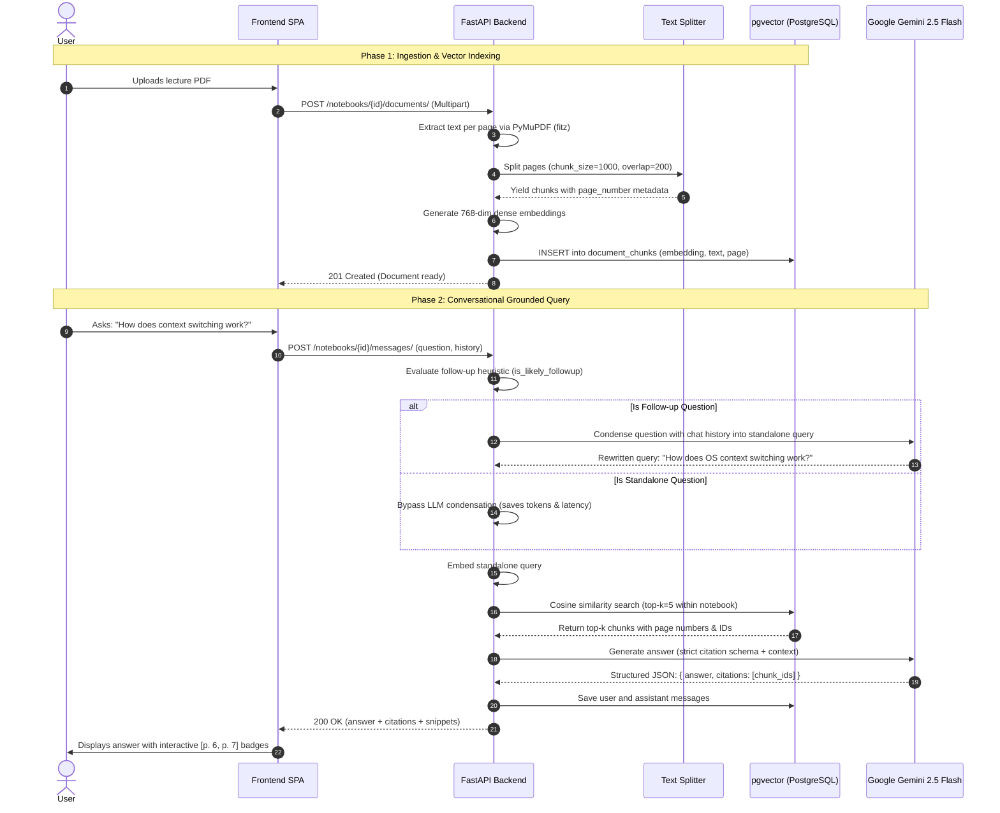

# Grounded RAG Pipeline & Vector Search

This document explains the technical implementation of SourceLearn's Retrieval-Augmented Generation (RAG) pipeline, covering document ingestion, text chunking, vector embeddings, similarity search, conversational query condensation, and grounded citation synthesis.

---

## 1. High-Level RAG Flow



---

## 2. Ingestion & Chunking Strategy

### PDF Text Extraction
Document ingestion is handled by `pdf_service.py` using **PyMuPDF (`fitz`)**:
- Iterates over each PDF page sequentially.
- Extracts textual content along with page number metadata (1-indexed).
- Strips non-printable ASCII noise and normalizes excessive whitespace.

### Text Splitting Parameters
Chunking is executed by `chunking_service.py` via LangChain's `RecursiveCharacterTextSplitter`:
- **Chunk Size**: `1,000` characters.
- **Chunk Overlap**: `200` characters.
- **Separators**: `["\n\n", "\n", ". ", " ", ""]` to preserve syntactic and semantic sentence boundaries.
- **Metadata Binding**: Every generated chunk permanently retains its `document_id` and original `page_number`.

```python
text_splitter = RecursiveCharacterTextSplitter(
    chunk_size=1000,
    chunk_overlap=200,
    length_function=len,
    is_separator_regex=False,
)
```

---

## 3. Vector Embedding & Cosine Similarity Search

### Dense Vector Representations
- Embeddings are computed with dense vector representations (`vector(768)`).
- Chunks and queries are mapped into the same vector space, enabling semantic retrieval even when queries use synonyms not present in the original document.

### pgvector Query Execution
Retrieval queries filter by `notebook_id` and compute nearest neighbors using the **cosine distance operator (`<=>`)**:

```sql
SELECT 
    dc.id,
    dc.document_id,
    dc.text,
    dc.page_number,
    1 - (dc.embedding <=> :query_embedding) AS similarity
FROM document_chunks dc
JOIN documents d ON dc.document_id = d.id
WHERE d.notebook_id = :notebook_id
ORDER BY dc.embedding <=> :query_embedding ASC
LIMIT 5;
```

---

## 4. Multi-Turn Conversational Query Condensation

In a conversational setting, users frequently ask contextual follow-ups such as:
> *"Why does it do that?"*  
> *"What was the second example?"*  
> *"Tell me more about its overhead."*

Searching vector embeddings for *"Why does it do that?"* yields irrelevant chunks because the pronoun lacks semantic meaning.

### Follow-up Heuristic Filter (`is_likely_followup`)
Before invoking Gemini to condense the question, SourceLearn runs a fast lexical heuristic to detect pronouns or conversational markers:

```python
FOLLOW_UP_INDICATORS = {
    "it", "its", "they", "them", "their", "this", "that", "these", "those",
    "former", "latter", "previous", "above", "mentioned", "second", "third", "first",
    "also", "too", "more", "else", "again", "another", "instead"
}

FOLLOW_UP_PHRASES = [
    "what about", "how about", "why is that", "why does that", "tell me more",
    "can you explain that", "elaborate", "give an example", "what does that mean"
]
```

- **Standalone queries** (e.g., *"What is virtual memory and paging?"*) bypass the condensation call completely.
- **Contextual queries** trigger a concise condensation prompt to Gemini 2.5 Flash, returning a self-contained query with no extra explanations.

---

## 5. Grounded Answer Synthesis & Citations

### Prompt Engineering
The synthesis prompt strictly instructs Gemini to act as a factual academic tutor and penalizes hallucinated claims:

1. **Context Boundary**: Answers must only use the provided numbered context chunks.
2. **Inline Citation Format**: Every claim drawn from a source must be accompanied by its bracketed chunk ID (e.g., `"...manages CPU time [17]."`).
3. **Pydantic Response Schema**: Responses are constrained to a strict JSON structure validated against the `AnswerResponse` schema:

```python
class AnswerResponse(BaseModel):
    answer: str
    citations: List[int]  # List of cited chunk IDs
```

4. **Missing Information Handling**: If the provided sources do not contain sufficient evidence, the model is instructed to explicitly state:
   > *"The provided sources do not contain enough information to answer this question."*

---

## 6. Frontend In-Document Highlighting UX

When the backend returns an answer:
1. Inline citations are parsed and converted into interactive pills: `<button className="citation-pill">📄 p. 6</button>`.
2. Clicking a citation pill triggers `handleCitationClick`:
   - Opens `PdfViewerPane` in split-screen mode.
   - Sets the viewer to the cited `page_number`.
   - Passes `citedSnippet` to the canvas renderer, which searches the PDF text layer and applies an amber highlight over the supporting passage.
